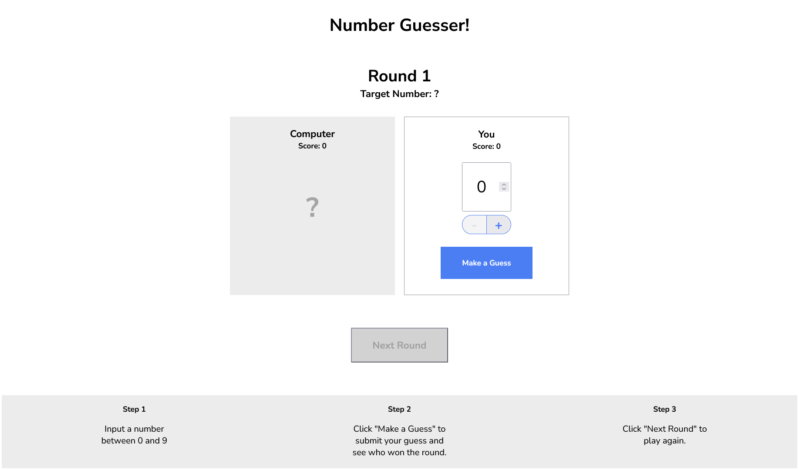

# A Number Guesser / Codecademy

This is a solution to the **"Challenge Project: Number Guesser"** on Codecademy.

The goal of this project is to develop JavaScript functions that drive a small browser-based guessing game, allowing you to test your code and debug using the browser’s console.

---

## Table of contents

- [Overview](#overview)
- [Project Goals](#project-goals)
- [Features](#features)
- [Screenshot](#screenshot)
- [Links](#links)
- [Built With](#built-with)
- [Author](#author)
 
---

## Overview

This project provides the open-ended requirements describing a small guessing game. The game is implemented in the browser, and you interact with it through JavaScript functions in script.js.

You are expected to use your knowledge of JavaScript, as well as online resources, to complete the project. This project builds on the first three sections of Introduction to JavaScript in Codecademy’s Frontend Engineer course.

---

## Project Goals

- Write JavaScript functions to handle the game logic for a small number guessing game.
- Integrate your functions into a web page using HTML and CSS.
- Ensure your functions work correctly with the provided game.js file, which calls them based on user interactions.
- Test your functions in the browser console and debug any syntax or logic errors.

---

## Features

- Four JavaScript functions that control game interactions.
- Browser-based gameplay with real-time feedback.
- Integration with HTML and CSS for a complete interactive experience.
- Debugging support through the browser console.

---

## Screenshot

---

## Links

- **Project Description:** [Codecademy Challenge Project](https://www.codecademy.com/journeys/front-end-engineer/paths/fecj-22-building-interactive-websites/tracks/fecj-22-javascript-syntax-part-i/modules/wdcp-22-number-guesser-0b03857c-d568-47a9-9867-c73f1536d20c/projects/number-guesser-independent-practice)
- **Live Demo:** [Add live site URL here](https://your-live-site-url.com)
- **Source Code:** [Add GitHub repository URL here](https://github.com/...)

---

## Built With

- HTML5
- CSS3
- Vanilla JavaScript
- Browser console for testing and debugging

---

## Author

- **Website:** [Andrei Martinenko](https://www.frontender.biz/)  
- **GitHub:** [@AxinitM](https://github.com/AxinitM)  
- **Codecademy Profile:** [Andrei Martinenko](https://www.codecademy.com/profiles/system5869051486)
